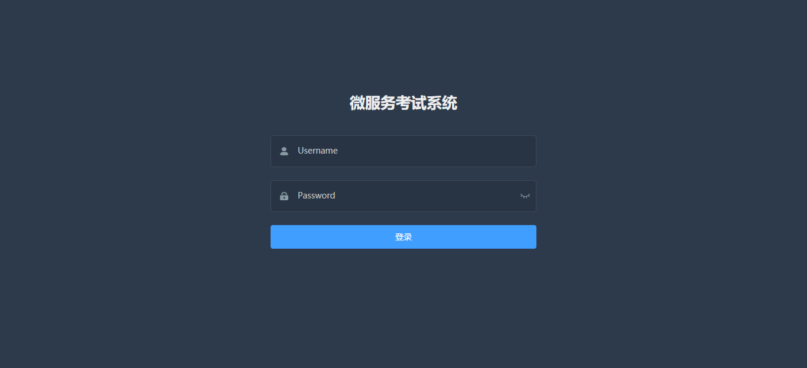
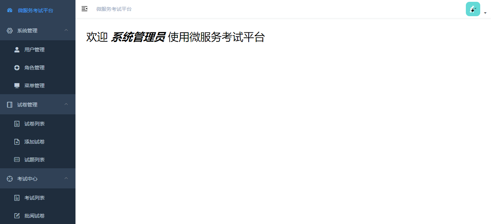
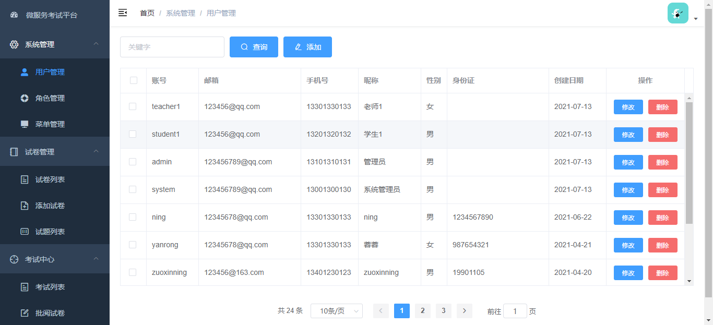
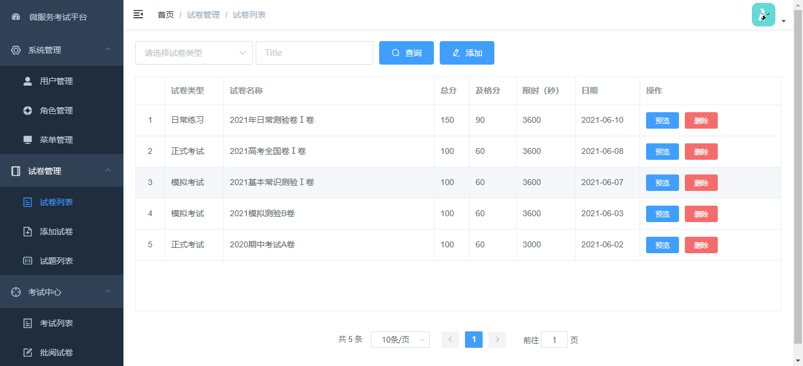
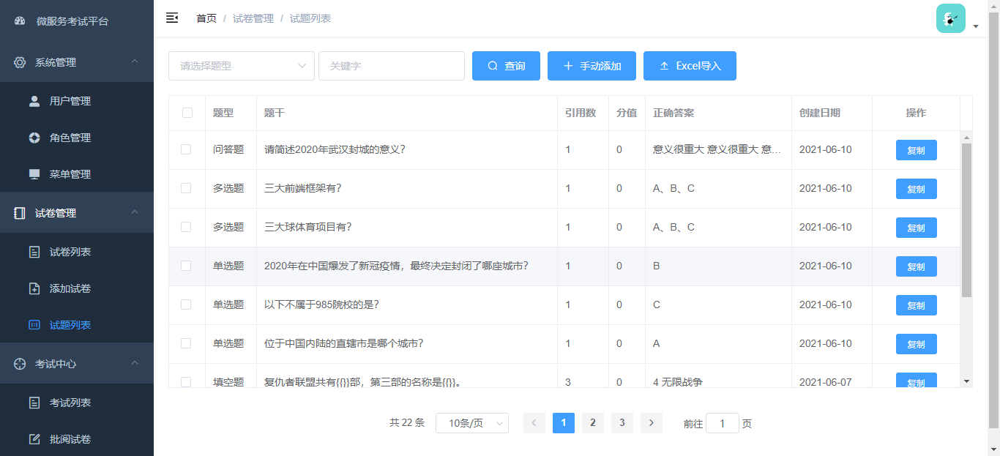
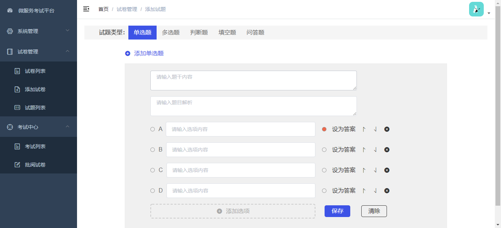
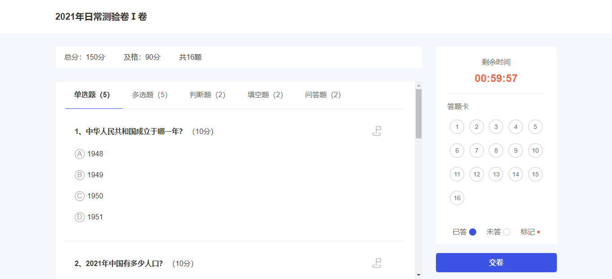
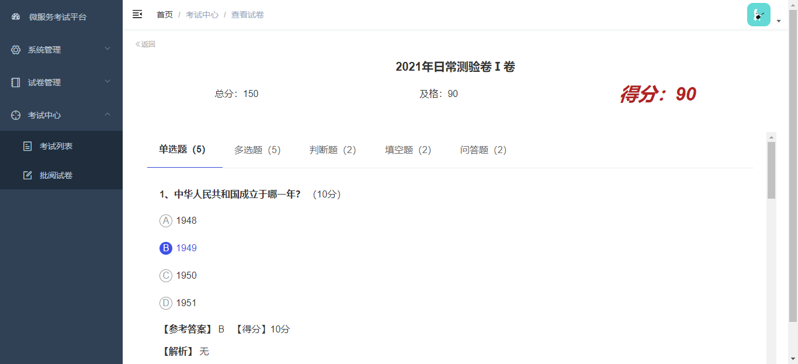

## 系统简介
* 采用前后端分离的模式，前端框架选型vue-element-admin，后端代码地址：   
* 后端采用Spring Boot、Spring Cloud & Alibaba、Mybatis-plus。
* 注册中心、配置中心选型Nacos，权限认证使用OAuth2。

## 系统功能
1. 用户管理：添加用户及用户基本信息的维护。
2. 角色管理：角色信息的维护及对应权限范围的控制。
3. 菜单管理：菜单权限信息的维护。
4. 试卷管理：添加试卷、预览试卷、发布试卷、删除试卷。
5. 试题管理：试题的管理，分为单选、多线、填空、判断、简答5钟题型。
6. 考试管理：考试、阅卷（客观题自动阅卷）、查看错题。

## 演示图

***

***

***

***

***

***

***

## 部署文档
下载前端代码,安装依赖【npm install】，本地运行【npm run dev】。

